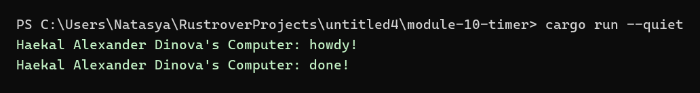

# Module 10 Timer

## Identity

Signature: **Haekal Alexander Dinova**

## Project Description

This repository contains Tutorial 1 for Module 10: Asynchronous Programming. The project follows the timer and executor example from the Rust Async Book and records each experiment separately.

## How to Run

```bash
cargo run --quiet
```

## Experiment 1.1: Initial Code

In this experiment, I implemented the original timer and executor code from the Rust Async Book. The program creates a custom `TimerFuture`, a `Spawner`, an `Executor`, and a `Task` type. The spawned async task prints a message, waits for two seconds through `TimerFuture`, and then prints the completion message. I changed the output signature to `Haekal Alexander Dinova's Computer` so the program output is consistent with the identity used in this repository. The executor runs until all spawned tasks are complete and the spawner has been dropped. The visible delay between `howdy!` and `done!` shows that the future is first pending and then woken by the timer thread.



## Commit and Pull Request Links

The final commit and pull request links will be collected after all experiment pull requests are merged.
