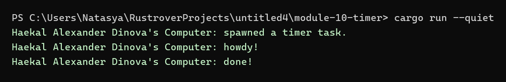
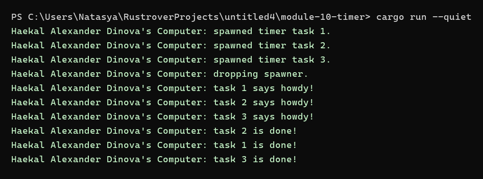
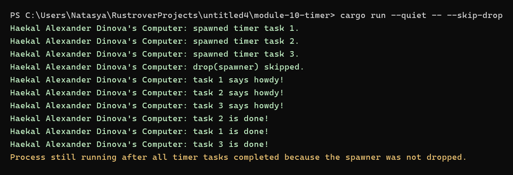

# Module 10 Timer

## Identity

Signature: **Haekal Alexander Dinova**

## Project Description

This repository contains Tutorial 1 for Module 10: Asynchronous Programming. The project follows the timer and executor example from the Rust Async Book and records each experiment separately.

## How to Run

```bash
cargo run --quiet
```

## Experiment 1.1: Initial Code

In this experiment, I implemented the original timer and executor code from the Rust Async Book. The program creates a custom `TimerFuture`, a `Spawner`, an `Executor`, and a `Task` type. The spawned async task prints a message, waits for two seconds through `TimerFuture`, and then prints the completion message. I changed the output signature to `Haekal Alexander Dinova's Computer` so the program output is consistent with the identity used in this repository. The executor runs until all spawned tasks are complete and the spawner has been dropped. The visible delay between `howdy!` and `done!` shows that the future is first pending and then woken by the timer thread.


## Experiment 1.2: Understanding How It Works

I added a print statement immediately after `spawner.spawn(...)`. The new line appears before `howdy!` because `spawn` only places the future into the executor queue. The async block itself is still lazy and has not been polled at that moment. After `drop(spawner)`, the program calls `executor.run()`, and only then does the executor start receiving queued tasks and polling the future. The first poll runs the async block until it reaches `TimerFuture::await`, so `howdy!` appears after the outside print. The future returns `Pending`, the timer thread later wakes the task, and the executor polls it again until `done!` is printed.



## Experiment 1.3: Multiple Spawn and Removing Drop

In this experiment, I spawned three timer tasks with durations of one, two, and three seconds. The spawn messages appear first because those prints are outside the async blocks and run immediately while tasks are being queued. When the executor starts, it polls every queued task once, so all `howdy` messages appear before any timer finishes. The completion messages appear in timer-duration order, which demonstrates that each future can be woken independently and returned to the executor queue. The `Spawner` owns the sending side of the channel and is responsible for putting new tasks into the executor queue. The `Executor` owns the receiving side, waits for ready tasks, and polls each task until it finishes or becomes pending again. The `Task` stores the future and knows how to requeue itself through its waker. Calling `drop(spawner)` closes the last external sender after all intended tasks have been spawned, so `executor.run()` can exit when the queue is empty. Without `drop(spawner)`, the receiving side still sees a live sender, so the executor keeps waiting for more tasks even after all current tasks are done.

Run with `drop(spawner)`:

```bash
cargo run --quiet
```



Run without dropping the spawner:

```bash
cargo run --quiet -- --skip-drop
```



## Commit and Pull Request Links

### Commits

- [Experiment 1.1: Original timer from the book](https://github.com/A-Haekal-Alexander-Dinova-2406352424/module-10-timer/commit/fcc498bb264c0b0e81709978ad117c50ad534aae)
- [Experiment 1.2: Understanding how it works.](https://github.com/A-Haekal-Alexander-Dinova-2406352424/module-10-timer/commit/30cd7e21da8b0373c518be2c7246c1c0d7a4a0d9)
- [Experiment 1.3: Multiple Spawn and removing drop](https://github.com/A-Haekal-Alexander-Dinova-2406352424/module-10-timer/commit/66507251a460ad9160905c77f1b19ef7406b1807)

### Pull Requests

- [PR #1: Experiment 1.1: Original timer from the book](https://github.com/A-Haekal-Alexander-Dinova-2406352424/module-10-timer/pull/1)
- [PR #2: Experiment 1.2: Understanding how it works.](https://github.com/A-Haekal-Alexander-Dinova-2406352424/module-10-timer/pull/2)
- [PR #3: Experiment 1.3: Multiple Spawn and removing drop](https://github.com/A-Haekal-Alexander-Dinova-2406352424/module-10-timer/pull/3)
